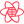
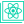

<div align="center">
  <div style="margin-bottom: 12px;">
    <h3 style="font-size: 24px; margin-bottom: 4px;">Abolhassan Ashoori</h3>
    <p style="margin-bottom: 0;">"Strive to Thrive"</p>
  </div>
  <div style="margin-bottom: 4px;">
    <b>Front-End Developer</b>
    <p style="margin-bottom: 0;">React & TypeScript Expert</p>
  </div>
  <p>
    <a href="#">Website </a><i></i> •
    <a href="https://x.com/abolhasanashori">X</a> •
    <a href="https://www.linkedin.com/in/abolhasanashori">LinkedIn</a> •
    <a href="https://t.me/abolhasanashori">Telegram</a>
  </p>
</div>

## 🙂 About Me 
<div style="display: flex; flex-wrap: wrap; gap: 12px; width: 100%; justify-content: center">
  
  
  
  
  
  
  
  
  
  
  
  
  
  
  
  
  
  
  
  
  
  
  
  
  
  
  
  
  
  
  
  
  
  
  
  
  
  
  
  
  
  
  
  
  
  
  
  
  
  
</div>

Hi there!👋

I'm Abolhasan Ashori, a passionate developer who has dedicated the last few years
to exploring the world of programming, or as I like to call it, 'The Power of Creation'.
I am completely fascinated by the endless possibilities it offers.

My programming journey began with C/C++, which I like to call 'The Godfather of Modern Programming Languages.'
during my time in college. I then ventured into Java, which may be a bit slow, but I absolutely love it! ❤️
I also delved into the Spring framework for a year. Subsequently, I transitioned to C# and ASP.Net Core,
thinking of it as 'Java, but easier,' and focused on back-end programming.

Currently, I'm a front-end developer specializing in JavaScript/TypeScript, the dynamic duo! 😎
I'm particularly fond of React and NextJS, actively honing my skills in these technologies
and seeking ways to improve them further.

## 🔧 Technologies

```javascript
const react = ["Hooks", "Context", "Router"];
const languages = ["JavaScript", "TypeScript", "HTML", "CSS"];
const frameworks = ["React", "NextJS"]; // I know 'React' is not a framework
const stateManagers = ["TanStack Query", "Recoil"];
const styling = ["Emotion", "CSS Modules", "Tailwind CSS"];
const ui = ["MUI", "Bootstrap", "Figma", "Adobe XD"];
const forms = ["Formik", "Yup"];
const api = ["Axios"];
const animations = ["react-transition-group", "Swiper", "Lottie"];
const development = ["Prettier", "ESLint", "Lint Staged", "Commit lint"];
const collaboration = ["Git", "Azure DevOps", "YouTrack", "Mizito"];
const other = ["leaflet", "TanStack Table", "i18next", "ChartJS", "Vite"];
const skills = ["Responsive Design"];
```

## 🌱 Currently learning / Want to learn

- **Language:** C#
- **Library:** Solid, Preact, Svelte, Web Components
- **UI:** Lit, Mantine, Semantic, Headless, Ant Design, Charka, Tailwind CSS
- **Framework:** Remix, Astro, Fresh
- **Backend:** NodeJS, SvelteKit, Deno, ASP.Net Core
- **Mobile:** React Native, Android
- **Desktop:** Electron, Tauri
- **Other:** Biome
- **PWA**
- **Testing**
- **CI/CD**

## 💼 Work Experience

**Front-End React Developer** <br />
[**Arad Accelerator**](https://didban-arad.ir) <br />
October 2022 - October 2025

- Worked on several developing and maintaining features for the company management panels and website.
- Led and managed the entire front-end development lifecycle, taking full ownership of implementation and maintenance.
- Implemented RESTful APIs, WebSockets, integrated third party payment gateway (Zarinpal)
  to extend project's functionality.
- Implemented git version control and documentations to significantly improve projects scalability and manageability.
- Collaborated in several management platforms like Azure DevOps boards and Mizito to ensure timely delivery.
- Participated in Agile ceremonies, contributing to the adoption of Agile methodologies and improve team collaboration.

**Front-End React Developer** <br />
[**Farin Group**](https://farin.group) <br />
January 2025 - October 2025

## 🚀 Projects

**MotoPlus** (Classified) <br />
Stationary Vehicle Violation Management System

**MotoPark** (Classified) <br />
Advanced On-Street Parking Management System

**ParkingPlus** (Classified)

**BusSurvey** (Classified)

**Arad Accelerator Website**

**FanArad**

**Meta School**

---

<div align="center" style="margin-top: 24px; font-size: 16px">
  
  <p style="margin-bottom: 0;">Powered By</p>
  <a href="https://obsidian.md">Obsidian</a>
</div>
